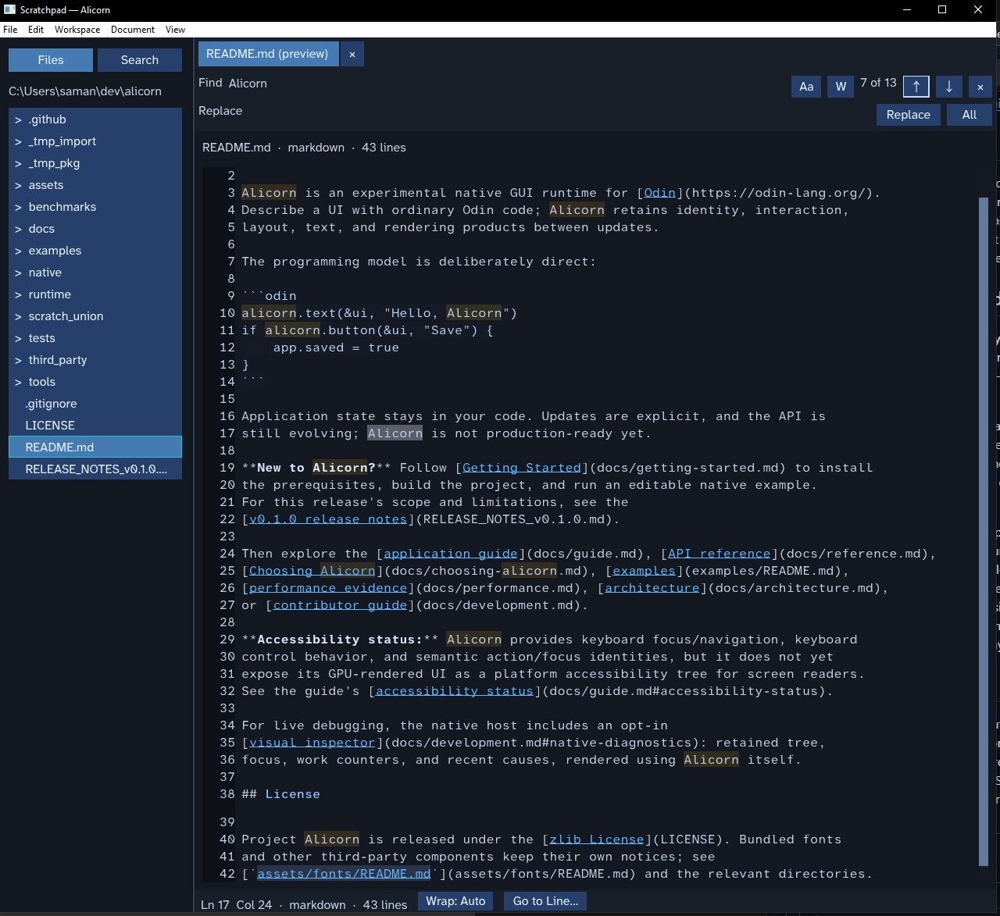

# Alicorn

Alicorn is an experimental native GUI runtime for [Odin](https://odin-lang.org/).
Describe a UI with ordinary Odin code; Alicorn retains identity, interaction,
layout, text, and rendering products between updates.

The programming model is deliberately direct:

```odin
alicorn.text(&ui, "Hello, Alicorn")
if alicorn.button(&ui, "Save") {
	app.saved = true
}
```

<p align="center">
  
</p>

<p align="center"><sub>Scratchpad running on Alicorn.</sub></p>

Application state stays in your code. Updates are explicit, and the API is
still evolving; Alicorn is not production-ready yet.

**New to Alicorn?** Follow [Getting Started](docs/getting-started.md) to install
the prerequisites, build the project, and run an editable native example.
For this release's scope and limitations, see the
[v0.1.0 release notes](RELEASE_NOTES_v0.1.0.md).

For the reusable native distribution path, see
[Native application packaging](docs/packaging.md).

Then explore the [application guide](docs/guide.md), [API reference](docs/reference.md),
[Choosing Alicorn](docs/choosing-alicorn.md), [examples](examples/README.md),
[typed themes](docs/themes.md),
[performance evidence](docs/performance.md), [architecture](docs/architecture.md),
or [contributor guide](docs/development.md).

**Accessibility status:** Alicorn provides keyboard focus/navigation and a
backend-neutral semantic runtime model, but no OS accessibility bridge is
implemented. Its GPU-rendered controls are not exposed to screen readers. See
the guide's [accessibility status](docs/guide.md#accessibility-status).

For live debugging, the native host includes an opt-in
[visual inspector](docs/development.md#native-diagnostics): retained tree,
focus, work counters, and recent causes, rendered using Alicorn itself.

## Acknowledgements

Alicorn is its own experiment, but its design has been informed by ideas and
work from other GUI projects:

- [Shirei](https://github.com/hasenj/go-shirei) for direct application-facing
  UI authoring and practical GUI applications.
- [GPUI](https://github.com/zed-industries/zed/tree/main/crates/gpui) and
  [Fenestra](https://github.com/richer-richard/fenestra) for thoughtful
  explorations of desktop UI architecture and developer tooling.
- [Dear ImGui](https://github.com/ocornut/imgui) and
  [egui](https://github.com/emilk/egui) for the lesson that UI interaction can
  live beside application logic without a parallel application-owned widget
  state graph.
- [Xilem and Masonry](https://github.com/linebender/xilem) for work on
  incremental UI systems and retaining or pruning derived work.
- [Skald](https://github.com/BuLEEto/Skald) for advancing GUI development in
  Odin and as the project where the work that became Runa began.

The runtime is built with [Odin](https://odin-lang.org/) and its native host
uses [SDL3](https://www.libsdl.org/) / SDL_GPU. Text shaping and rasterization
are provided by [Runa](https://github.com/BuLEEto/Runa), vendored in
[`third_party/Runa`](third_party/Runa). These acknowledgements distinguish
design influences from technical foundations; they are not a complete
dependency or licensing inventory. See the relevant component directories
and notices for third-party terms.

## License

Project Alicorn is released under the [zlib License](LICENSE). Bundled fonts
and other third-party components keep their own notices; see
[`assets/fonts/README.md`](assets/fonts/README.md) and the relevant directories.
