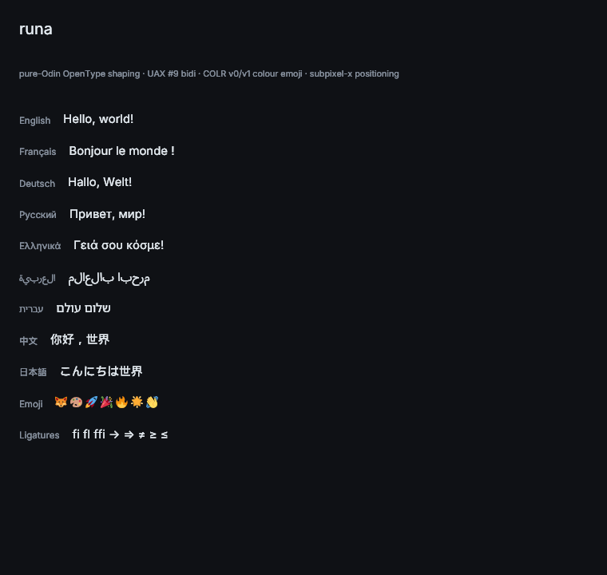

# runa

A pure-Odin modern text engine — parsing, itemization, shaping,
line-breaking, rasterization. Built first to replace fontstash +
stb_truetype in [Skald](https://github.com/BuLEEto/Skald), designed
to be useful for any Odin project that needs production-quality text.

**Status:** v1.2.3 — Arabic cursive joining across combining marks, on
top of v1.2.2's Indic reph fix, v1.2's bounded shape cache (LRU),
v1.1's Latin autohinter, and v1.0's complex-script punch list. UAX #9
bidi at **100 %**, UAX #29 graphemes at 100 %, CFF2 variable instances,
COLRv1 emoji with the full 28 W3C composite blend modes + linear /
radial / sweep gradients, GPOS mark-to-ligature, frozen API
([`API.md`](API.md)), per-script shaping for **Devanagari, Bengali,
Gujarati, Kannada, Odia, Tamil, Telugu, Malayalam, Gurmukhi, Thai,
Lao, Khmer, Myanmar**, and a Thai word-break dictionary so Thai
paragraphs reflow at word boundaries rather than as one giant
unbreakable word. Full scoreboard in [`CHANGELOG.md`](CHANGELOG.md).

Shaping accuracy varies by script — see
[Script status](#script-status) before picking runa for a specific
language. Latin, Cyrillic, Greek and unpointed Hebrew are solid; Malayalam,
some Devanagari conjuncts, Arabic ligatures-with-marks and Hebrew
nikud have known divergences from HarfBuzz.

<p align="center">
  
</p>

<p align="center"><sub>Latin · Cyrillic · Greek · Arabic (joined + RTL) · Hebrew (RTL) · Chinese · Japanese · colour emoji · OpenType ligatures.</sub></p>

## What this is

The current Odin text-rendering story is `vendor:fontstash` plus
`stb_truetype` — a glyph atlas and basic kerning. That covers Latin
text at small scales but cannot:

- Shape complex scripts (Arabic joining, Devanagari conjuncts, Thai
  clusters, bidi).
- Break lines per Unicode UAX #14.
- Render colour emoji (COLRv0 / COLRv1 / CBDT / sbix tables).
- Apply OpenType features (ligatures, GPOS kerning, contextual
  alternates, stylistic sets).
- Subpixel-position glyphs.

`runa` is the long-term fix — a modern text engine in idiomatic
Odin with zero C dependencies at v1.0.

## v1.0 punch list status

All four items closed:

- **Thai word-break dictionary** — opt-in PyThaiNLP corpus (~62 k
  entries), longest-match trie. Off by default (grapheme fallback);
  enable with `-define:RUNA_THAI_DICT=true` and honour its CC-BY-SA. ✓
- **Complex Khmer multi-consonant clusters** — pre-base reorder
  fixed to move to syllable start, not just before base. ✓
- **Full Myanmar shaping** — joined the Indic pipeline; medial
  YA / medial RA / IPC=Top_And_Bottom_And_Left all reorder
  correctly. ✓
- **Two remaining bidi BidiCharacterTest mismatches** — ISR
  formation now tunnels through `all-BN` higher-level
  intervening runs. 100.00 % conformance. ✓

Per-feature deliverables, conformance numbers, and tracked
patch-level work in [`CHANGELOG.md`](CHANGELOG.md).

## Script status

Honest scoreboard. "Matches HarfBuzz" means shaped glyph IDs were
compared against HarfBuzz on that script's test corpus — not that
every possible string is guaranteed identical.

| Script | Status |
|---|---|
| Latin / Cyrillic / Greek | Matches HarfBuzz. Production. |
| Hebrew | Unpointed text matches HarfBuzz, including RTL through the bidi pipeline. Pointed text (nikud) orders combining marks differently — see normalization gap below. |
| Arabic | Joining, marks and mark positioning match HarfBuzz. **Ligatures do not skip marks** — `لَا` fails to form lam-alef. |
| Devanagari | Common words match (`नमस्ते`, `हिन्दी`). NGA conjuncts (`कङ्क`) diverge. |
| Bengali / Gujarati / Kannada / Odia / Gurmukhi / Tamil / Telugu | Spot-checked against HarfBuzz and matching on those samples. Not swept. |
| **Malayalam** | **Known divergence on common words** — `കാര്യം` shapes differently from HarfBuzz. |
| Thai / Lao | Standard GSUB plus the Thai word-break dictionary. |
| Khmer / Myanmar | Indic pipeline; canonical syllables checked, long tail unverified. |
| CJK | Via cmap; no script-specific reordering needed. |
| Colour emoji | COLRv0 + COLRv1 + CBDT + sbix, all 28 blend modes. |

The non-shaping layers — bidi, line break, grapheme / word / sentence
segmentation, normalization — are held to Unicode's own conformance
suites and sit at 100 % (line break 99.94 %). Those numbers are in
[`CHANGELOG.md`](CHANGELOG.md) and re-checked in CI.

Known gaps are tracked per release in [`CHANGELOG.md`](CHANGELOG.md)
rather than hidden.

## Building

The library is a set of plain Odin packages — no build script needed.

```
odin check . -no-entry-point          # type-check the library
odin test  tests/parse                # parser tests
odin test  tests/raster               # rasterizer smoke tests
odin test  tests/runa                 # facade integration tests
```

The runnable demos:

```
# PGM-output, no GUI dependency — shapes Latin + emoji, writes a PPM
# image you can open in any viewer.
odin run examples/hello_world -- \
    tests/fonts/Roboto-Regular.ttf \
    tests/fonts/Twemoji-Mozilla.ttf \
    /tmp/hello.ppm

# Live raylib window — shows OpenType shaping, kerning, ligatures,
# and tinted text running through raylib's stock DrawTexturePro.
# ~50 lines of glue between runa and the renderer; demonstrates that
# runa is renderer-agnostic — works in any Odin project that can
# sample a texture and draw a quad (sokol_gfx, custom Vulkan / Metal,
# even a pure CPU pixel buffer).
odin run examples/raylib
```

Test fonts are not committed — fetch them into `tests/fonts/` per
[`tests/fonts/README.md`](tests/fonts/README.md), or let CI fetch
them. Tests that need a missing font skip with an INFO log so the
synthetic suite still runs on a fresh clone.

## License

`runa` is licensed under the **zlib license** — see
[`LICENSE`](LICENSE). Permissive, GPL-compatible, the same licence
Odin's own standard library uses.

Embedded Unicode UCD data files (`Scripts.txt`, `LineBreak.txt`,
`DerivedBidiClass.txt`) ship under the Unicode-DFS-2016 licence.
Test fonts are not committed — see
[`tests/fonts/README.md`](tests/fonts/README.md) for per-font
sources and licences.

## Contributing

API is frozen ([`API.md`](API.md)) — bidi at 100 %, line break at
99.94 %, graphemes at 100 %, UAX #29 word boundaries at 100 %,
UAX #15 normalization (NFC / NFD / NFKC / NFKD) at 100 %, all 28
COLR composite blend modes, CFF2 variations, and shapers for the
9 Brahmic scripts (Devanagari, Bengali, Tamil, Telugu, Kannada,
Malayalam, Gurmukhi, Gujarati, Odia) plus 4 SEA (Thai, Lao,
Myanmar, Khmer) — see [Script status](#script-status) for
per-script accuracy. See
[`CONTRIBUTING.md`](CONTRIBUTING.md) for build / test instructions
and the open-work pointer list (long-tail Khmer cluster polish,
performance hardening, COLRv1 sweep gradients).
